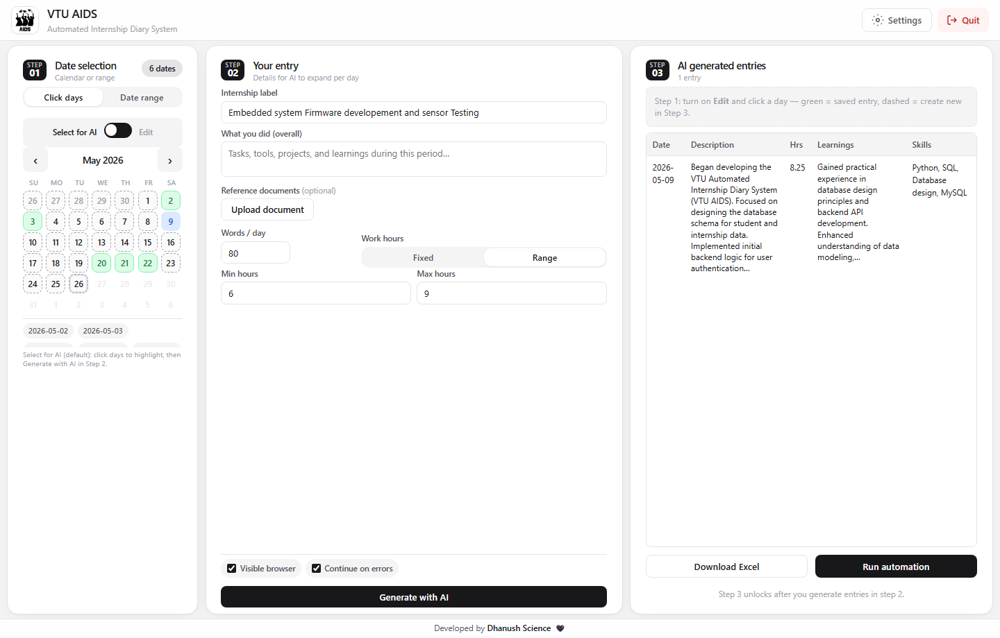
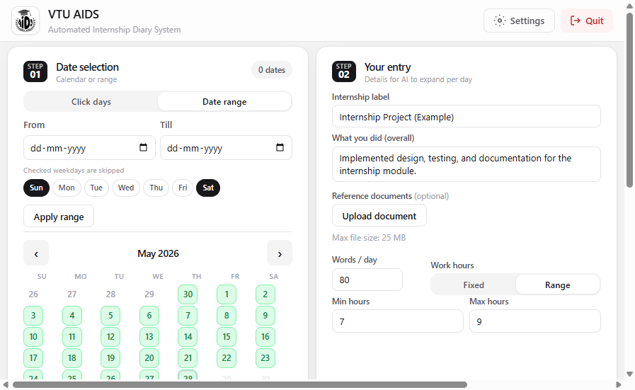
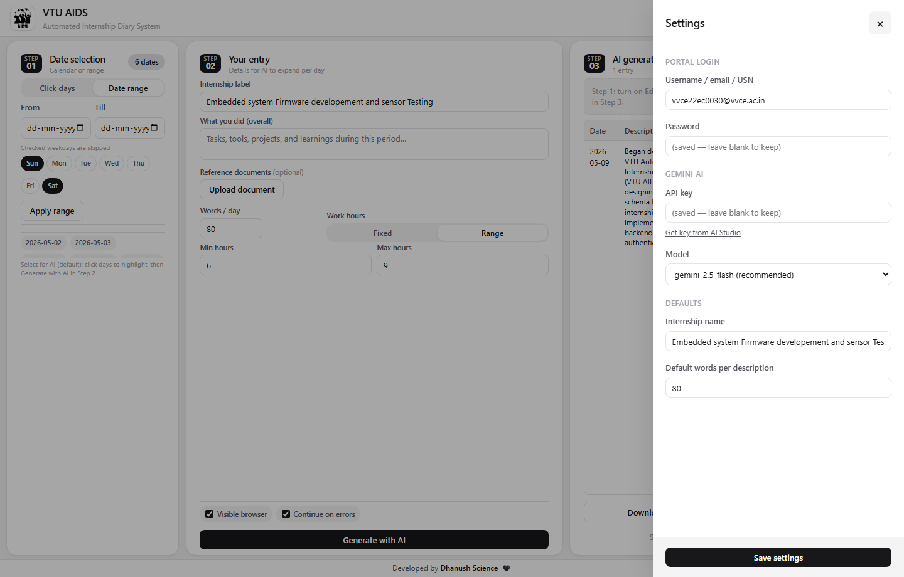
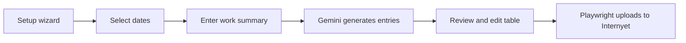

<p align="center">
  
</p>

<h1 align="center">VTU AIDS</h1>

<p align="center">
  <strong>A</strong>utomated <strong>I</strong>nternship <strong>D</strong>iary <strong>S</strong>ystem for
  <a href="https://vtu.internyet.in">VTU Internyet</a>
</p>

<p align="center">
  Generate internship diary entries with Gemini AI, review them locally, and upload to the portal with Playwright automation.
</p>

<p align="center">
  <a href="https://github.com/dhanushscience/VTU-AIDS/releases/download/v1.0.4/VTU_AIDS_Setup.exe">
    
  </a>
</p>

<p align="center">
  <sub>Windows 10/11 · ~277 MB · includes Chromium for automation</sub>
</p>

<p align="center">
  <a href="docs/INSTALL.md">Installation guide</a> ·
  <a href="docs/RELEASE_v1.0.4.md">v1.0.4 release notes</a> ·
  <a href="docs/windows.md">Windows notes</a> ·
  <a href="SECURITY.md">Security</a> ·
  <a href="LICENSE">MIT License</a>
</p>

---

> **Disclaimer:** Use only if permitted by your institution and portal terms. Not affiliated with VTU or Internyet.  
> **Developed by Dhanush Science**

---

## What's new in v1.0.4

- **First-run setup wizard** — mandatory 3-step flow (Welcome → portal login → Gemini API) before the main UI unlocks
- **Friendly errors** — short messages in the app; full technical details in `%LOCALAPPDATA%\VTU AIDS\vtu_aids_error.log`
- **Automation browser** — headed Chromium pops to the front once; view-only overlay so you can watch without clicking the portal
- **Clean shutdown** — quitting stops the bot and Playwright Chromium; stale state is cleared after a force-close
- **Smart App Control helpers** — install scripts and docs for unsigned local builds ([docs/windows.md](docs/windows.md))

---

## Screenshots

| Overview | Date range | Settings |
|:--:|:--:|:--:|
|  |  |  |

---

## Features

- **3-step workflow** — select dates → describe your work → generate & upload
- **First-run setup wizard** — guides portal login and Gemini API configuration
- **Calendar or date range** with weekday skip (e.g. skip Sundays)
- **Gemini AI** expands one work summary into per-day descriptions, skills, and learnings
- **Optional documents** — PDF, PPTX, Word, images, code files as AI context
- **Edit before upload** — tweak any day in Step 3
- **Playwright automation** — logs into Internyet and submits entries (optional visible browser)
- **Excel export** — download `entries.xlsx` anytime
- **Windows installer** — standalone `.exe` with bundled Chromium (~280 MB)

---

## Quick start (Windows installer)

**For most users — no Python needed.**

1. Download [**VTU_AIDS_Setup.exe**](https://github.com/dhanushscience/VTU-AIDS/releases/download/v1.0.4/VTU_AIDS_Setup.exe) (or see all [**Releases**](https://github.com/dhanushscience/VTU-AIDS/releases/tag/v1.0.4)).
2. Run the installer and open **VTU AIDS** from the Start menu.
3. Complete the **first-run setup wizard** (portal login + [Gemini API key](https://aistudio.google.com/apikey)).
4. **Step 1** — pick dates · **Step 2** — describe work → **Generate with AI** · **Step 3** — **Run automation**.

📖 Full walkthrough with screenshots: **[docs/INSTALL.md](docs/INSTALL.md)**

---

## Manual setup (developers)

**Requirements:** Windows 10/11, Python 3.11+, Gemini API key, VTU Internyet account.

```powershell
git clone https://github.com/dhanushscience/VTU-AIDS.git
cd VTU-AIDS
python -m venv .venv
.\.venv\Scripts\pip install -r requirements-desktop.txt
.\.venv\Scripts\python -m playwright install chromium
copy student_config.example.json student_config.json
python vtu_aids.py --browser
```

Open **http://127.0.0.1:8765/** — complete the setup wizard or use **Settings**, then follow the 3-step UI.

| Mode | Command |
|------|---------|
| Browser (recommended) | `python vtu_aids.py` or `python vtu_aids.py --browser` |
| Embedded window | `python vtu_aids.py --desktop` |
| Dev + hot reload | `python vtu_aids.py --dev` |

---

## How it works



1. **Setup wizard (first run)**  
   Enter VTU Internyet credentials and a Gemini API key. The main UI unlocks when setup is complete.

2. **Step 01 — Date selection**  
   Click individual days or use **Date range** with From/Till dates. Skip weekends via weekday pills.

3. **Step 02 — Your entry**  
   Enter the exact **internship label** from the portal dropdown, describe what you did overall, optionally attach reference files, set words/day and work hours → click **Generate with AI**.

4. **Step 03 — AI generated entries**  
   Review the table. Turn on **Edit** in Step 1 to fix individual days. Click **Run automation** to upload (uses saved portal credentials). With **Visible browser** enabled, Chromium opens in front with a view-only overlay.

**Data location:** `%LOCALAPPDATA%\VTU AIDS\` (config, entries, logs) — not synced to OneDrive.

---

## Build the installer yourself

```powershell
powershell -ExecutionPolicy Bypass -File build\build_windows.ps1
```

Requires [Inno Setup 6](https://jrsoftware.org/isinfo.php). Output:

`build\Output\VTU_AIDS_Setup.exe`

Optional code signing: set `VTU_AIDS_SIGN_PFX` and `VTU_AIDS_SIGN_PASSWORD` before building.

If **Smart App Control** blocks the unsigned installer on your PC, use `build\Output\Run-VTU_AIDS_Setup.bat` or see [docs/windows.md](docs/windows.md).

---

## Project structure

```
vtu-aids/
├── app/
│   ├── cli.py              # Entry point (packaged as VTU AIDS.exe)
│   ├── main.py             # REST API + static UI
│   ├── errors.py           # User-facing errors + debug logging
│   ├── browser_display.py  # Headed automation: focus + view-only overlay
│   ├── process_cleanup.py  # Shutdown + stale bot/Chromium cleanup
│   └── run_diary_bot.py    # Portal automation
├── static/                 # Web UI (HTML, CSS, JS, logo)
├── build/                  # PyInstaller spec, Inno Setup, SAC helpers
├── docs/                   # Install guide, release notes, screenshots
├── generated/              # JSON schema + sample (your entries are local)
├── vtu_aids.py             # Dev launcher wrapper
├── VTU_skills.txt          # Skills list for AI prompts
└── student_config.example.json
```

---

## Configuration

Copy `student_config.example.json` → `student_config.json` (gitignored) or use the **setup wizard** / **Settings** in the app.

| Field | Purpose |
|-------|---------|
| `username` / `password` | VTU Internyet login |
| `gemini_api_key` | AI generation ([AI Studio](https://aistudio.google.com/apikey)) |
| `default_internship` | Exact portal dropdown text |
| `gemini_model` | e.g. `gemini-2.5-flash` |

Optional: `.env` with `GEMINI_API_KEY=` (see `.env.example`).

---

## CLI (advanced)

```powershell
.\.venv\Scripts\python app\run_diary_bot.py ^
  --json generated\entries.json ^
  --config student_config.json ^
  --headed --skip-on-error
```

Dry-run with sample data: `--dry-run` and `generated/entries.sample.json`.

---

## Troubleshooting

| Issue | Solution |
|-------|----------|
| Smart App Control blocks exe | Turn SAC **Off** (Windows Security); read `SMART_APP_CONTROL.txt` in install folder or [docs/windows.md](docs/windows.md) |
| First launch | Setup wizard appears if credentials are missing |
| Errors in UI | Short message shown; full details in `%LOCALAPPDATA%\VTU AIDS\vtu_aids_error.log` |
| `Automation exited with code 1` + `No module named 'app'` | Update to latest build (v1.0.4+) with script-mode import fix |
| `Automation exited with code 1` + `Executable doesn't exist` | Run `python vtu_aids.py --install-browser` once to reinstall Playwright Chromium |
| Automation stuck after force-close | Reopen VTU AIDS — stale bot state and orphan Chromium are cleared on startup |
| App fails to start (~300 KB exe) | Reinstall — valid `VTU AIDS.exe` is ~19 MB |
| Black desktop window | Use `python vtu_aids.py --browser` |
| Generate button not visible | Hard refresh (Ctrl+Shift+R) or reinstall |
| Logs | `vtu_aids_error.log`, `bot_run.log`, `vtu_aids_startup.log` in `%LOCALAPPDATA%\VTU AIDS\` |

More: **[docs/windows.md](docs/windows.md)** · **[docs/RELEASE_v1.0.4.md](docs/RELEASE_v1.0.4.md)**

---

## Security

**Never commit** `student_config.json`, `.env`, or `generated/entries.json`.  
See **[SECURITY.md](SECURITY.md)**.

---

## Contributing

Issues and pull requests welcome. Please do not include credentials in issues.

---

## License

[MIT](LICENSE) — Copyright (c) 2026 VTU AIDS contributors
